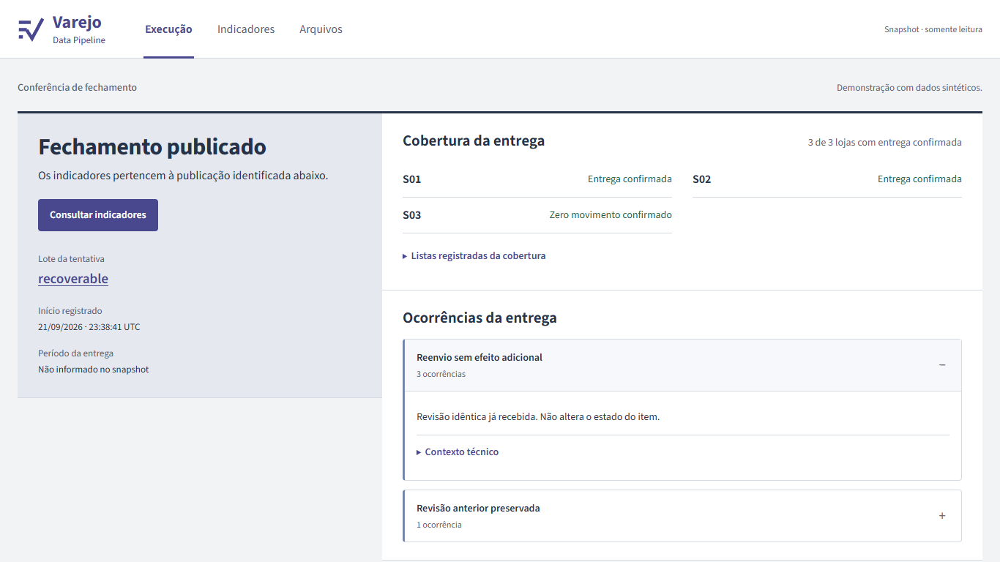
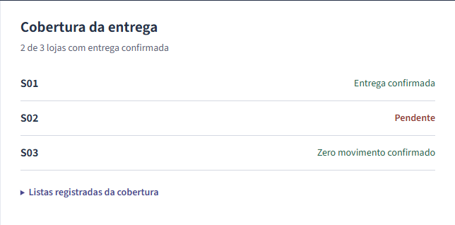
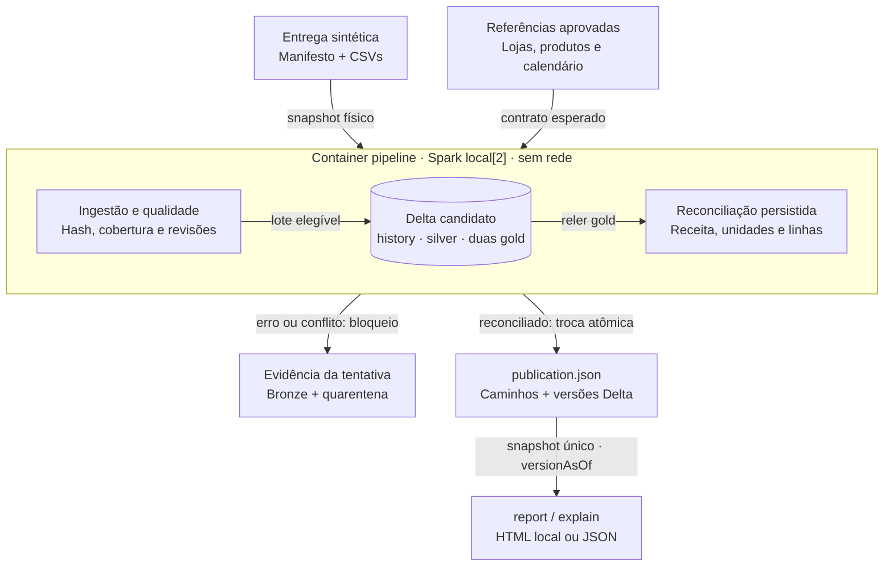
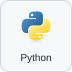
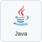

# Varejo Data Pipeline

Conferência de entregas e revisões de vendas antes de publicar um fechamento.

<!-- Navegação do README -->
<p>
  <a href="#demonstração"></a>
  <a href="#arquitetura"></a>
  <a href="#executar-localmente"></a>
  <a href="#verificação-e-evidências"></a>
  <a href="https://www.linkedin.com/in/arthur-joanes-6a2967373/"></a>
</p>

## Visão geral

O projeto responde a três perguntas: o total está completo, quais revisões foram aceitas e a qual publicação cada indicador pertence? Desenvolvi a ingestão, as regras de revisão, a [publicação por manifesto](src/retail_pipeline/publication.py) e o relatório para uma rede fictícia. Os dados são sintéticos; não há adoção comercial nem ganho financeiro medido.

<a id="na-prática"></a>
<a id="como-uma-falha-aparece-para-quem-consulta"></a>

## Demonstração



_Página principal do relatório. Os registros abaixo identificam os cenários e resultados demonstrados._



O recorte de **22/09/2026** usa o renderer atual sobre dados históricos: duas de três lojas confirmadas e S02 pendente. É uma reprodução visual, sem novo processamento Spark. [Origem e limites da captura](docs/evidence/image-review-20260922.json) · [capturas](docs/image-review.md).

Na execução de **22/09/2026, 12:06–12:09 UTC**, o lote inicial publicou **R$ 64,00 e três vendas**. A ausência de S02 bloqueou a nova entrega. Mover só um item de A1 para outro dia também foi bloqueado, embora a soma continuasse correta. A correção integral foi aceita; uma revisão posterior levou a **R$ 74,00**. São valores da fixture, não preços ou faturamento real. [Entradas e resultados](docs/evidence/editorial-20260922/business-thesis.json) · [comandos, imagem e datas](docs/evidence/editorial-20260922/execution.json).

| Caso da mesma execução                      | Resultado observado                                        |
| ------------------------------------------- | ---------------------------------------------------------- |
| Entrega de S02 ausente                      | Bloqueio; R$ 64,00 anteriores permanecem publicados        |
| Apenas um item de A1 muda de dia            | `SALE_DATE_CONFLICT`; receita sozinha não aprova a revisão |
| Processo falha entre as duas tabelas finais | Leitores oficiais continuam em R$ 64,00/R$ 64,00           |
| Retomada e repetição                        | R$ 74,00; repetição `NO_CHANGE`, mesma publicação          |

A demonstração histórica que termina em R$ 77,00 tem outra sequência e permanece separada no [roteiro](docs/demo.md).

<a id="implementação"></a>
<a id="como-protejo-a-publicação"></a>

## Arquitetura

O fechamento passa por três fronteiras: **entrega recebida**, **candidato calculado** e **publicação autorizada para leitura**. O batch é um processo Spark local; as tabelas Delta compartilham o volume de estado, mas cada uma tem sua própria versão. Por isso, o ponto de publicação é um manifesto que fixa o conjunto de versões.



| Responsabilidade | Implementação e contrato |
| ---------------- | ------------------------ |
| Fixar o que se espera das lojas | [`references.py`](src/retail_pipeline/references.py) grava `operator-references.json`; o calendário enviado na entrega não redefine a cobertura aprovada. |
| Preservar e validar a entrada | [`ingestion.py`](src/retail_pipeline/ingestion.py) copia bytes antes do parsing; [`batch_contracts.py`](src/retail_pipeline/batch_contracts.py) e [`contracts.py`](src/retail_pipeline/contracts.py) conferem documentos e linhas. Um erro bloqueia o lote inteiro. |
| Resolver revisões e calcular indicadores | [`pipeline.py`](src/retail_pipeline/pipeline.py) coordena as etapas; [`transformations.py`](src/retail_pipeline/transformations.py) deduplica histórico, escolhe a maior revisão e agrega apenas `UPSERT` nas duas gold. |
| Tornar várias tabelas visíveis juntas | [`publication.py`](src/retail_pipeline/publication.py) mantém `flock` de escritor único e substitui o ponteiro JSON com `fsync` + `os.replace`; leitores usam os caminhos e versões registrados. |
| Consultar e apresentar o fechamento | [`reporting.py`](src/retail_pipeline/reporting.py) lê um snapshot; [`report_model.py`](src/retail_pipeline/report_model.py) define o payload e [`report_view.py`](src/retail_pipeline/report_view.py) renderiza o HTML. |

No caminho principal, `run` adquire o lock, copia a entrega e compara suas revisões com o **histórico da publicação anterior**. Sem conflitos, grava candidatos, relê e reconcilia as duas gold, então troca `publication.json`. Se houver falha entre gravações, o ponteiro anterior continua válido; a retomada recompõe o candidato a partir dele. Repetir um lote já publicado retorna `NO_CHANGE` após as validações. [Fluxo e falhas exercitados](tests/integration/test_pipeline.py).

O [Compose](compose.yaml) monta o estado em `/data`, o código somente para leitura em `/app` e as exportações em `artifacts/`. O servidor opcional acessa apenas as exportações; abrir o relatório não executa Spark nem atualiza os dados. Veja os [grãos das tabelas, a sequência de publicação e os limites de recuperação](docs/architecture.md).

<a id="o-que-eu-implementei"></a>
<a id="stack"></a>

## Stack e decisões

<p>
  
  
  
  
</p>

| Componente                    | Papel e escolha verificável                                                 |
| ----------------------------- | --------------------------------------------------------------------------- |
| Python/PySpark                | Validação de entrada e transformações em lote                               |
| Delta Lake                    | Histórico e versões por tabela; o manifesto da aplicação reúne a publicação |
| Java                          | Runtime do Spark dentro da imagem                                           |
| Docker Compose                | Estado local isolado e servidor opcional do relatório                       |
| HTML, CSS e JavaScript locais | Relatório portátil com leitura básica sem JavaScript                        |

O projeto fixa **Spark 4.2.0 e Delta 4.4.0** nas [dependências Python](pyproject.toml), combinação prevista nas [notas oficiais Delta](https://github.com/delta-io/delta/releases/tag/v4.4.0). O [Dockerfile](Dockerfile) define o runtime; os artefatos JVM reconstruídos localmente não são apresentados como releases oficiais.

Recalcular o histórico simplifica revisões e retomadas, mas exige processamento e armazenamento adicionais. Não houve comparação que prove vantagem sobre uma solução menor. [Código da projeção](src/retail_pipeline/transformations.py); [alternativas e compromissos](docs/decisoes-tecnicas.md).

<a id="executar-e-verificar"></a>
<a id="executar-no-windows"></a>

## Executar localmente

Use Docker Desktop com containers Linux, Compose e PowerShell no Windows. Python e Java do batch são instalados pela imagem. O primeiro build precisa de rede; o batch configurado executa sem rede. O [wrapper](scripts/pipeline.ps1) reúne os comandos abaixo.

```powershell
.\scripts\pipeline.ps1 setup
.\scripts\pipeline.ps1 demo
.\scripts\pipeline.ps1 serve
```

Abra [localhost:3103/report.html](http://localhost:3103/report.html). No Linux, use `sh scripts/pipeline.sh` com os mesmos comandos. `demo` cria estado com UUID; as exportações em `artifacts/` representam a execução mais recente do comando. [Wrapper Linux](scripts/pipeline.sh) e [demo](src/retail_pipeline/demo.py). [Roteiro completo e limpeza](docs/demo.md).

<a id="ler-e-verificar-o-fechamento"></a>

## Verificação e evidências

Para executar a prova de negócio em estado temporário:

```powershell
docker compose run --rm --entrypoint python pipeline scripts/verify_problem.py --thesis-only --output /app/artifacts/thesis
```

O [runner](scripts/verify_problem.py) chama o [teste de negócio](tests/integration/test_business_thesis.py), que confere resultados com Spark/Delta.

| Evidência                                                                   | Data e alcance                                                                 |
| --------------------------------------------------------------------------- | ------------------------------------------------------------------------------ |
| [Caso de negócio](docs/evidence/editorial-20260922/business-thesis.json)    | 22/09/2026; cobertura, revisão integral e falha entre tabelas                  |
| [Identidade da execução](docs/evidence/editorial-20260922/execution.json)   | 22/09/2026; imagem, comandos e preparação; build com cache                     |
| [Recuperação](docs/evidence/state-proof/restore.json)                       | Execução histórica identificada no registro; restauração em destino local novo |
| [Scan da revisão editorial](docs/evidence/editorial-20260922/security.json) | 22/09/2026; resultado vinculado à imagem examinada                             |

Resultados antigos não certificam commits posteriores. [Inventário das verificações](docs/verification.md) · [fontes e afirmações](docs/fontes-e-afirmacoes.md).

<a id="limites-e-manutenção"></a>
<a id="limites-que-mantive-explícitos"></a>

## Limites e segurança

O escopo é local: sem autenticação multiusuário, streaming ou implantação Fabric executada. A [publicação](src/retail_pipeline/publication.py) depende do filesystem Linux e de um único escritor. Não há limpeza automática de versões Delta nem prova de recuperação fora do computador; o [ensaio de restauração](docs/evidence/state-proof/restore.json) usa um novo destino local.

Os limites de entrada são parâmetros configuráveis, não capacidade medida: por padrão, **1 MiB por JSON, 64 MiB por arquivo, 256 MiB por entrega e 1.000 arquivos**. [Implementação dos limites](src/retail_pipeline/input_limits.py) e [configuração](compose.yaml). O scan preserva achados e suas datas; “zero HIGH/CRITICAL” em uma imagem não significa ausência de vulnerabilidades. [Registro do scan](docs/evidence/editorial-20260922/security.json), de **22/09/2026**.

## Documentação

[Padrão compartilhado da documentação](docs/padrao-documentacao.md) · [Fontes e afirmações](docs/fontes-e-afirmacoes.md).

| Para consultar                 | Documento                                                                                                           |
| ------------------------------ | ------------------------------------------------------------------------------------------------------------------- |
| Fluxo, cenários e demonstração | [Demo](docs/demo.md) · [problema e solução](docs/problem-solution.md)                                               |
| Contratos e implementação      | [Arquitetura](docs/architecture.md) · [dados](docs/data-contract.md) · [decisões](docs/decisoes-tecnicas.md)        |
| Operação e riscos              | [Recuperação](docs/state-recovery.md) · [runtime](docs/runtime-upgrade.md) · [segurança](docs/security.md)          |
| Interface e capturas           | [Interface](docs/interface.md) · [qualidade](docs/frontend-quality.md) · [origem das imagens](docs/image-review.md) |
| Rastrear afirmações            | [Fontes, datas e limites](docs/fontes-e-afirmacoes.md)                                                              |
| Evolução proposta              | [Adaptação Fabric, não executada](docs/fabric-mapping.md)                                                           |

## Autor e licença

<p><a href="https://www.linkedin.com/in/arthur-joanes-6a2967373/"> <strong>Arthur Joanes no LinkedIn</strong></a></p>

[Licença MIT](LICENSE). Ícones da stack e LinkedIn: [Devicon, licença MIT](docs/stack/LICENSE.devicon).
