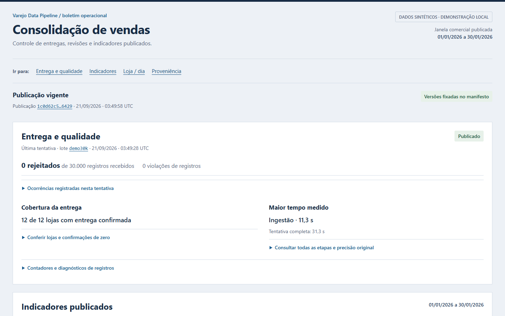

# Varejo Data Pipeline

Pipeline local de fechamento de vendas com PySpark, Delta Lake e Spark SQL. Valida arquivos, cobertura de lojas e revisões antes de publicar indicadores: uma soma correta pode esconder uma loja faltando ou contar a mesma venda em dois dias. A demonstração usa apenas dados sintéticos.



O operador aprova um calendário de lojas esperadas, e o pipeline valida as revisões por inteiro antes de fechar. Falha ou lote bloqueado mantém a publicação anterior. [Problema e solução](docs/problem-solution.md).

## Regras de publicação

- Silver e gold são recalculadas a partir do histórico aceito a cada lote, simplificando correção e recuperação. A demonstração de volume usa 30 mil linhas.
- Um lote novo não pode diminuir as lojas esperadas; mudar isso exige estado novo.
- CANCEL preserva o histórico e retira o item dos indicadores. Somente um UPSERT de revisão maior pode reativá-lo; revisões antigas não alteram o estado.
- Erro financeiro ou de cobertura bloqueia o lote inteiro.

Os testes cobrem falha entre tabelas, retomada sem duplicação e lock entre processos. A revisão do runtime passou na suíte de 166 testes, com 15 integrações; o ajuste posterior de preservação de evidência foi validado por 151 unitários e uma integração real. [Resultados, fontes e limites da verificação](docs/verification.md).

## Rodar no Windows

Docker Desktop em modo Linux, Compose v2 e PowerShell. Não precisa de Java nem Python no host.

```powershell
.\scripts\pipeline.ps1 setup
.\scripts\pipeline.ps1 demo
.\scripts\pipeline.ps1 serve
```

Abra [o relatório local](http://localhost:3103/report.html). No Linux, substitua `.\scripts\pipeline.ps1` por `sh scripts/pipeline.sh` nos mesmos comandos.

## A demo mostra o caso difícil

`demo` roda a sequência num estado isolado: lote válido, repetição, loja ausente, reposição, correção, cancelamento, falha antes de publicar e retomada. As receitas conferidas à mão são 64,00 → 64,00 → 64,00 → 64,00 → 77,00 → 57,00 → 57,00 → 77,00, com assert em cada passo. Compare `artifacts/report.html`, `blocked-report.html` e `failure-report.html` para ver a consequência de cada caso. [Roteiro](docs/demo.md).

A CLI devolve 0 para publicação ou lote sem mudança, 2 para bloqueio de qualidade ou argumento inválido e 3 para falha técnica. [Comandos e contrato](docs/data-contract.md).

## Limites

Delta faz transação por tabela; o manifesto e o lock do volume mantêm a consistência entre as tabelas. Não há VACUUM automático. O relatório mostra até 500 linhas e 20 produtos, com os totais do conjunto inteiro. Estorno parcial, orquestrador e monitoramento contínuo estão fora do escopo. [Código](src/retail_pipeline/pipeline.py) · [arquitetura](docs/architecture.md) · [decisões técnicas](docs/decisoes-tecnicas.md) · [proposta para Fabric](docs/fabric-mapping.md).

Python, PySpark, Delta Lake, Spark SQL e Docker. Licença MIT.

O runtime usa Spark 4.2.0 e Delta 4.4.0, com atualizações coordenadas das bibliotecas JVM e orçamento configurável de entrada. As dependências JVM têm achados conhecidos, com condições de exposição e triagem explícitas em [segurança](docs/security.md); o projeto não é uma implantação pública de Spark.

A migração, os hashes dos artefatos e os riscos residuais estão em [atualização do runtime](docs/runtime-upgrade.md).
