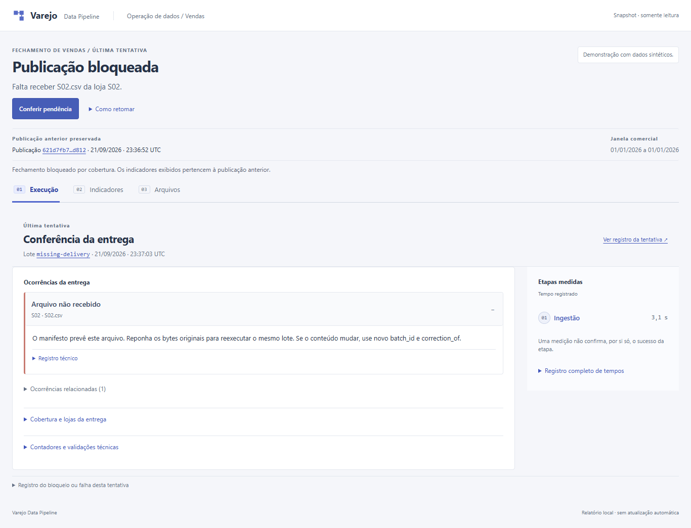

# Varejo Data Pipeline

Valide a entrega das lojas e as revisões de vendas antes de publicar o fechamento. O relatório mostra a tentativa mais recente, a publicação vigente e as ocorrências que explicam o resultado. A demonstração usa dados sintéticos.



Uma soma correta pode esconder uma loja faltando ou contar a mesma venda em dois dias. O operador aprova o calendário de lojas esperadas; o pipeline confere a entrega e as revisões antes de fechar. Um bloqueio ou uma falha antes da publicação mantém os indicadores anteriores. [Problema e solução](docs/problem-solution.md).

**Exemplo:** a venda A1 tem dois itens, de R$ 19,00 e R$ 5,00. Mover só o primeiro para o dia seguinte mantém R$ 24,00, mas passa a contar a mesma venda nos dois dias. O projeto bloqueia essa revisão com `SALE_DATE_CONFLICT`. Corrigir os dois itens juntos mantém uma venda e move os R$ 24,00 para o dia correto. O [caso completo](docs/problem-solution.md#exemplo-uma-soma-certa-com-a-contagem-errada) liga a entrada, a regra e o teste que a verifica.

## O que conferir na demonstração

| Situação | Resultado observável |
| --- | --- |
| Repetir uma entrega | A mesma receita, sem efeito duplicado |
| Uma loja não entrega | Fechamento bloqueado; a publicação anterior continua disponível |
| Corrigir ou cancelar um item | Revisão maior altera o estado; o histórico é preservado |
| Falhar antes de publicar e retomar | Candidato interrompido não aparece nos totais; a retomada publica sem duplicar |

O roteiro pequeno usa valores conferidos à mão: **64 → 64 → 64 → 64 → 77 → 57 → 57 → 77 reais**. O experimento de 30 mil linhas é separado e demonstra volume; não substitui a conferência desses casos. [Roteiro e evidências](docs/demo.md).

## Rodar no Windows

Docker Desktop em modo Linux, Compose v2 e PowerShell. Não precisa de Java nem Python no host.

```powershell
.\scripts\pipeline.ps1 setup
.\scripts\pipeline.ps1 demo
.\scripts\pipeline.ps1 serve
```

Abra [o relatório local](http://localhost:3103/report.html). No Linux, substitua `.\scripts\pipeline.ps1` por `sh scripts/pipeline.sh` nos mesmos comandos.

## Ler o fechamento

O HTML é uma leitura dos dados capturados na geração, sem atualização automática. Abre também como arquivo local e mantém o conteúdo acessível sem JavaScript.

- **Execução:** decisão da última tentativa, arquivo ou regra que exige atenção e caminho para conferir a pendência. Cobertura, contadores e registro técnico ficam nos detalhes. Etapas mostram somente tempos medidos.
- **Indicadores:** receita, vendas, unidades, ticket e recortes por dia, produto e loja. Os números pertencem à publicação identificada no topo.
- **Arquivos:** IDs completos, versões Delta, fontes bronze e hashes das referências aprovadas.

Compare `artifacts/report.html`, `blocked-report.html` e `failure-report.html`. O relatório distingue publicação concluída com auditoria incompleta de falha anterior à publicação; um tempo medido não prova sozinho o sucesso de uma etapa. [Comportamento e validação da interface](docs/interface.md).

## Como a publicação é protegida

Silver e gold são recalculadas a partir do histórico aceito a cada lote. Erro financeiro ou de cobertura bloqueia o lote inteiro. Uma entrega nova não pode reduzir as lojas esperadas; alterar esse calendário exige estado novo.

A saída oficial é um manifesto que aponta para versões exatas das tabelas. Isso resolve a falha em que a tabela por loja já foi gravada, mas a tabela por produto ainda não: leitores continuam nas versões anteriores até a troca do manifesto. Recompor o histórico simplifica essa recuperação e as correções de data, ao custo de reler mais dados a cada lote. [Decisões, motivos, código e limites](docs/decisoes-tecnicas.md#onde-as-decisões-aparecem-no-código).

`CANCEL` mantém o histórico e retira o item dos indicadores. Somente `UPSERT` com revisão maior pode reativá-lo. A CLI retorna 0 para publicação ou lote sem mudança, 2 para bloqueio de qualidade ou argumento inválido e 3 para falha técnica. [Contrato](docs/data-contract.md) · [Arquitetura](docs/architecture.md).

## Evidências e limites

A reconstrução do runtime passou em 188 testes, incluindo 15 integrações Spark/Delta. Depois de incorporar a interface, passaram os 182 unitários da fonte combinada, lint e tipos. O scan integral registra zero achados altos/críticos e um aviso médio por versão no Commons Lang corrigido por backport. As evidências distinguem cada revisão e os limites dos testes. [Resultados, fontes e reprodução](docs/verification.md).

Delta faz transação por tabela; o manifesto e o lock do volume mantêm a consistência entre tabelas. Não há VACUUM automático. O relatório mostra até 500 linhas, 20 produtos e 366 dias, com os totais do conjunto inteiro. Não contém histórico completo de execuções. Estorno parcial, orquestração e monitoramento contínuo estão fora do escopo. [Código](src/retail_pipeline/pipeline.py) · [Decisões técnicas](docs/decisoes-tecnicas.md) · [Proposta para Fabric](docs/fabric-mapping.md).

Python, PySpark, Delta Lake, Spark SQL e Docker. Licença MIT.

O runtime usa Spark 4.2.0 e Delta 4.4.0, com orçamento configurável de entrada e dependências JVM fixadas por hash. Três componentes têm builds locais identificados: Spark core com Jetty atualizado, assembly Hadoop para o batch local e Commons Lang 2.6 com um patch oficial específico. O primeiro build compila esses componentes e baixa suas ferramentas; exige mais tempo, rede e espaço. A execução do batch continua local e sem rede. As receitas foram verificadas em Linux/amd64. [Segurança, provas e limites](docs/security.md).

A migração, os hashes dos artefatos e a manutenção dos builds estão em [atualização do runtime](docs/runtime-upgrade.md).
