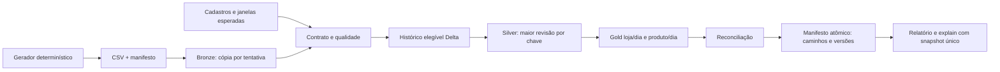

# Arquitetura

## Escopo
Rede fictícia entrega revisões completas de itens de venda. O operador precisa distinguir entrega incompleta, bloqueio financeiro, falha técnica e reexecução sem mudança. O analista lê somente uma publicação consistente e rastreável. Dados exclusivamente sintéticos; BRL; dia comercial America/Sao_Paulo. Fora do MVP: reembolso parcial, streaming, APIs e cloud.

## Runtime e recursos
Python 3.11.16, OpenJDK 17.0.20+8 (Alpine 17.0.20_p8-r0), PySpark 4.2.0 e Delta Lake 4.4.0 (Scala 2.13, artefato delta-spark_4.2_2.13). A combinação é suportada nas notas oficiais Delta 4.4.0. Versões, hashes das substituições JVM e componentes opcionais removidos estão nos locks e em [atualização do runtime](runtime-upgrade.md). Este é o runtime do batch local com catálogo em memória, sem Hive/Thrift, Derby ou REPL remoto.

Docker Compose `pf-varejo-data`; volume nomeado exclusivo para entrada gerada, Delta, temporários e logs. Exportação pequena em `artifacts/`. Spark local[2], shuffle 2, UI desabilitada, JVM inicialmente 1 GiB e container limitado a 3 GiB/2 CPUs. Execução sob demanda. HTML local, servidor opcional 127.0.0.1:3103.

## Contratos
- CSV UTF-8 com cabeçalho exato, uma revisão completa por registro. Chave: source_system/store_id/sale_id/line_id. Revisão inteira positiva. Dinheiro Decimal(18,2), quantidade positiva limitada; preço/desconto não negativos e desconto <= bruto.
- CANCEL é imagem completa validada, retida no estado/histórico, excluída de métricas. Revisão maior UPSERT pode reativar. Revisões menores não regridem. Datas ISO-8601 com offset, normalizadas em UTC; data comercial deriva de sold_at em São Paulo.
- Manifesto v1 identifica lote, origem, janela, cobertura e arquivos com SHA-256/contagem. Expectativa independente em catalog.json (lojas/produtos) e schedule.json (janela/lojas), nunca inferida só do manifesto. Loja sem movimento tem confirmação explícita; CSV de cabeçalho vazio requer essa confirmação.
- batch_id é identidade imutável do manifesto canonicalizado; run_id identifica tentativa UUID. Lote registrado continua imutável mesmo rejeitado. Arquivo ausente/corrompido pode ser reposto conforme hash original. Mudança de contrato exige novo batch_id e correction_of opcional.
- Bronze preserva cópias físicas e linhas brutas com arquivo/linha/lote/tentativa; quarentena registra lista de códigos por linha. Erros bloqueiam lote inteiro. Duplicatas e revisão antiga são informativos. Rejeitados são linhas únicas, violações contam cada código; denominador = registros recebidos.
- Conflito é chave+revisão com payload canônico divergente, comparado também ao histórico publicado. Histórico de tentativas bloqueadas/falhas não constitui autoridade. Hash exclui proveniência técnica.

## Modelo e publicação

Antes de processar entregas, `configure` grava `operator-references.json` sob o mesmo lock dos escritores. A configuração é validada, imutável e independente dos arquivos do remetente; cada tentativa conserva cópia, e cada fonte publicada conserva seu hash. Um `batch_id` novo não pode redefinir a cobertura. Estados legados continuam legíveis, mas não recebem confiança retroativa: devem ser reprocessados em novo estado configurado.

Após resolver revisões contra o histórico publicado, o candidato precisa manter um único dia comercial por origem/loja/venda ativa. Esse teste precede gravação de candidatos e também vale em `validate`. Reconciliação de receita não substitui essa regra: uma venda dividida entre dias pode preservar dinheiro e inflar `sales_count`.
Bronze por tentativa é diagnóstico, acessível ao operador. Histórico elegível (evento com proveniência), silver (uma linha/chave, inclusive canceladas), gold_store_day (loja/dia) e gold_product_day (produto/dia) são Delta. Histórico contém todas as revisões aceitas e elimina duplicatas exatas deterministicamente. Silver recompõe maior revisão e executa MERGE com origem única; gold recalcula tudo. Comparação por conjunto mostra silver = projeção. SQL calcula receita líquida, linhas, unidades, vendas distintas e ticket; produto tem receita/unidades e ranking derivado.

Toda mutação usa flock Linux exclusivo, liberado pelo kernel ao sair. Reconstruímos candidatos a partir do histórico da publicação anterior via versionAsOf e do lote atual, nunca latest não publicado. Cada tentativa grava versões candidatas; manifesto inclui caminhos/versões do histórico, bronze, silver e dois gold, lotes elegíveis e run_id. Reconciliação compara receitas, unidades e linhas silver/gold. JSON temporário + fsync + os.replace no mesmo volume realiza a troca final do ponteiro. Leitores capturam ponteiro uma vez e conservam esse snapshot. Estado técnico de tentativa não decide elegibilidade; ponteiro decide.

Falhas após ingestão, primeira gold e antes da troca são injetáveis somente em modo demo/teste. Publicação anterior continua acessível, e retomada recompõe sem receita duplicada. Retenção indefinida no MVP: não há VACUUM/limpeza automática. Garantia de processo/filesystem Linux local, sem promessa de consenso distribuído ou resistência a toda perda de energia.

## Alternativas e compromissos
Mais simples: Python + SQLite seria barato e suficiente ao volume, mas não demonstraria Spark/Delta, MERGE e time travel. Escolha: batch único Spark local com recomputação favorece inspeção e recuperação, ao custo de startup/JVM e escrita adicional. Mais complexa: Fabric/Airflow + incremental distribuído reduz recomputação em grande escala, mas exige custos e coordenação transacional diferentes; não justificado por 30 mil linhas. Bronze preservado em arquivos mais Delta é uma duplicação intencional para diagnóstico físico e consultas.

## Riscos e testes
Riscos: caminho host com Unicode/espaços (somente fontes/exportações em bind); mutações externas da entrada (copiar a entrada antes de validar); dinheiro/overflow (limites explícitos); candidato não publicado (versionAsOf obrigatório); escritor concorrente (flock real multiprocesso). Unitários cobrem contratos/geração e integração real cobre os cenários listados em verification.md, usando totais manuais. Smoke e jornada crítica em CI Docker. Relatório auto-contido revisado por screenshot real. Performance medida, sem extrapolar produção.

## Fontes consultadas
- https://docs.delta.io/releases/
- https://docs.delta.io/delta-update/
- https://spark.apache.org/docs/4.2.0/
- https://docs.docker.com/desktop/features/wsl/best-practices/

## Detalhes de implementação

O pipeline executa com network_mode:none depois do build. Código e raiz do container são somente leitura; escrita fica em dados e exportações. O batch mantém somente `DAC_OVERRIDE` para escrever exportações no bind do usuário Linux, sem alterar a propriedade dos arquivos do host; novos privilégios são proibidos. SHA-256 dos jars e digest da imagem base estão fixados. `gcompat` fornece a compatibilidade nativa necessária ao Snappy no Alpine; o smoke real exercita leitura e escrita comprimidas. Pip é removido do runtime após a instalação. Os achados JVM e as condições de isolamento estão em [segurança](security.md).

Gerador e validação física usam streaming Python; transformações tipadas e financeiras usam expressões Spark e SQL no módulo transformations.py. Após a troca do ponteiro, uma falha de auditoria é sinalizada como WARNING mantendo PUBLISHED, pois o manifesto é a autoridade de visibilidade. `scripts/benchmark.py` registra a duração e a memória máxima de sua execução em `artifacts/benchmark.json`.

## Módulos

`references.py` fixa e carrega a configuração aprovada do operador; não lê referências da pasta entregue para estabelecer confiança. `prepare_batch` sem configuração externa é apenas o verificador estrutural usado nos testes de formato; a entrada pública `process_batch` bloqueia quando não existe configuração aprovada.

`batch_contracts.py` recebe documentos já lidos e valida manifesto, catálogo e janela sem filesystem ou Spark. `ingestion.py` preserva bytes e faz parsing em fluxo. O fluxo transacional permanece explícito em `_process`; o lock, a auditoria e a decisão após commit continuam em funções próprias.

O relatório tem três fronteiras: `reporting.py` adquire dados de um snapshot e rastreia contribuições; `report_model.py` define `ReportPayload`; `report_view.py` produz HTML de dados capturados. `report.css` e `report.js` são recursos declarados no pacote e embutidos no HTML final. Não existem requisições externas ou backend da interface. JavaScript somente aprimora a cópia de identificadores; campos somente leitura, âncoras e detalhes nativos preservam a navegação sem script.

O motor grava datas Parquet com calendário gregoriano (`datetimeRebaseModeInWrite` e `int96RebaseModeInWrite` em `CORRECTED`). O padrão do Spark recusa datas anteriores ao calendário híbrido; o contrato aceita anos 0001–9999, por isso a escrita usa CORRECTED. A integração grava e relê datas dos anos 0001, 1800 e 9999; não há importação de arquivos Parquet arbitrários de leitores legados. [Semântica oficial Spark 3.5.9](https://spark.apache.org/docs/3.5.9/sql-data-sources-parquet.html#configuration).
