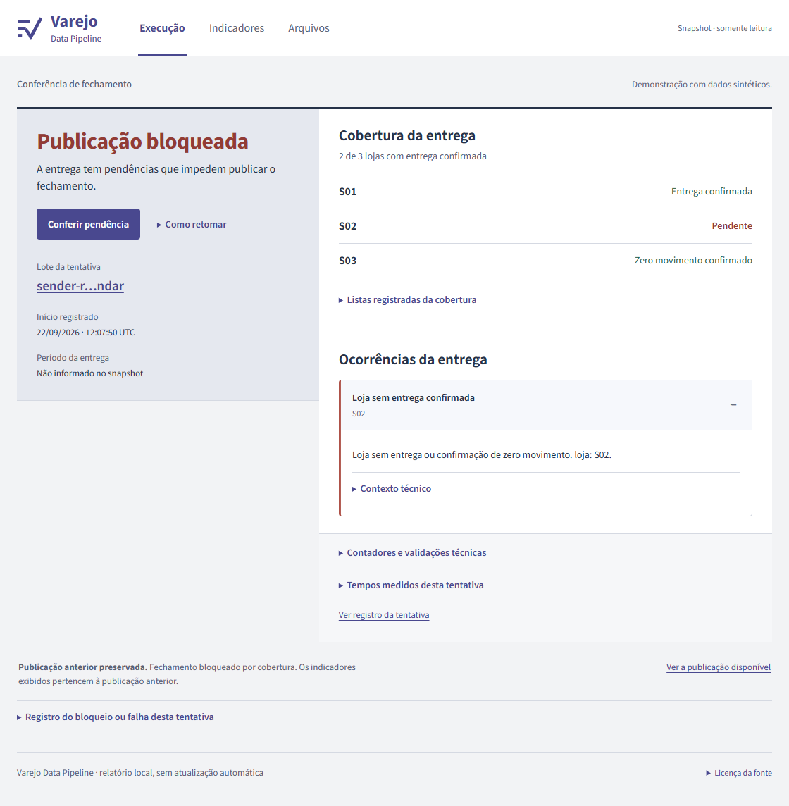
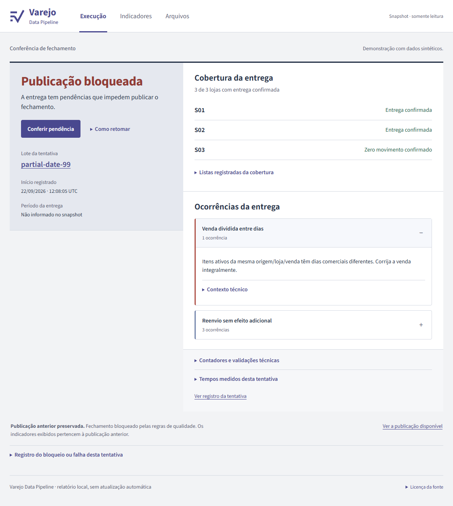
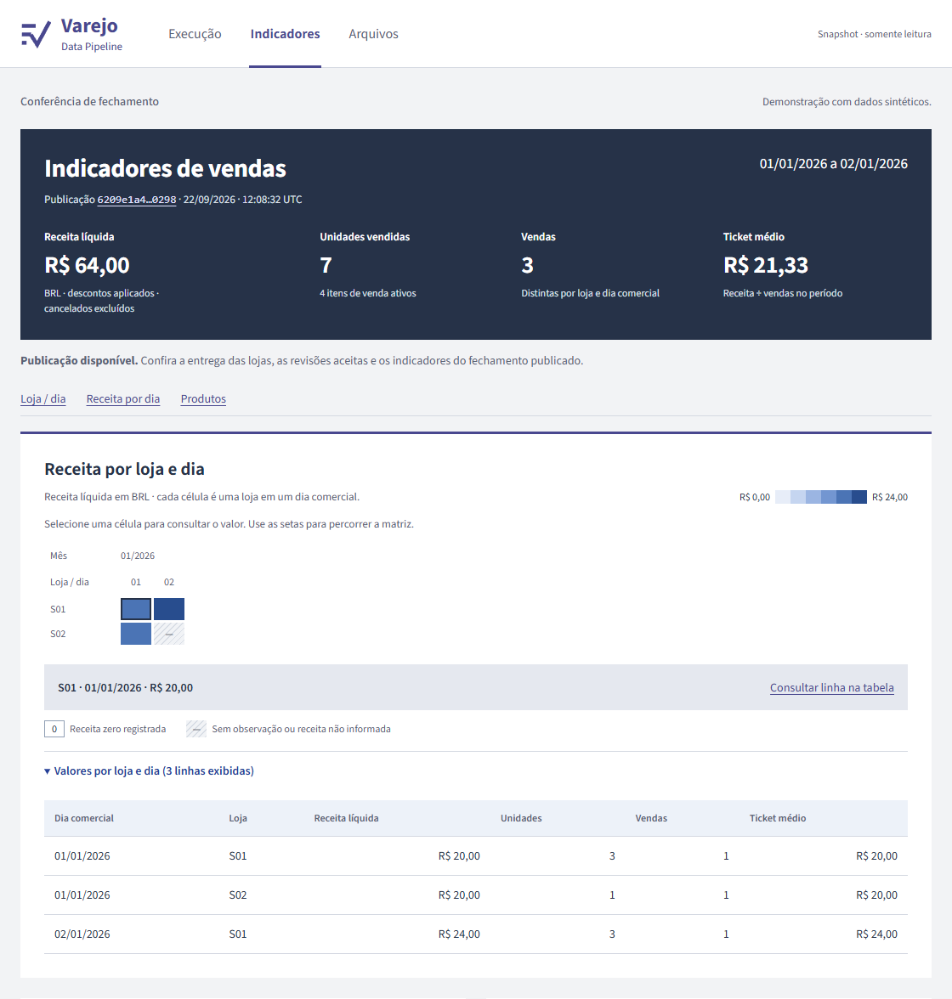
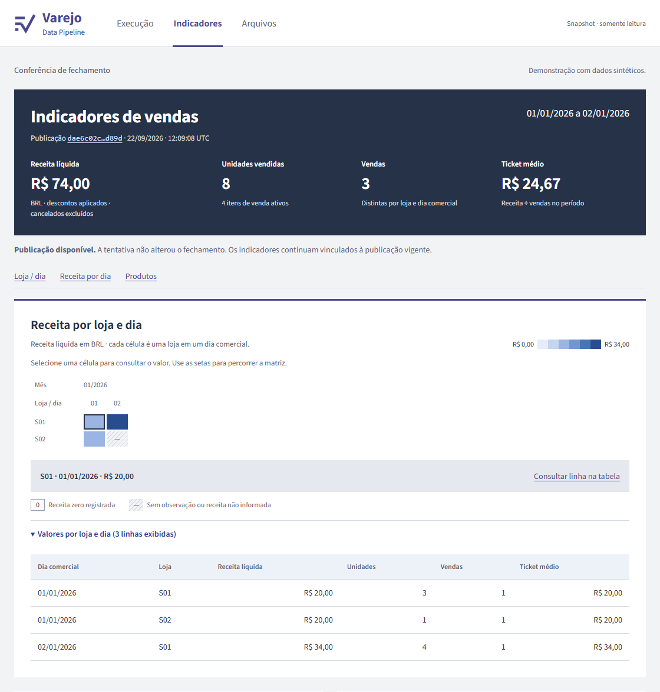

# Problema e solução

Desenvolvi este laboratório para a pessoa que precisa fechar vendas sem transformar uma entrega incompleta ou uma correção rejeitada em indicador oficial. O erro difícil não é somar CSV: é preservar a última publicação coerente quando chegam revisões, faltam lojas ou o processo falha entre tabelas.

Separei a expectativa da entrega: o operador aprova cadastro/calendário separadamente da entrega; o pipeline aceita apenas revisões de lotes publicados mais o candidato integralmente aprovado, mantém os itens ativos da mesma venda no mesmo dia comercial e publica um manifesto com versões Delta fixas. O consumidor captura esse manifesto uma vez. A decisão observável é publicar o fechamento ou bloquear e continuar servindo o anterior, com motivo e origem de cada indicador.

## Da entrega ao indicador

As quatro linhas de [`fixture_rows`](../src/retail_pipeline/generation.py) permitem conferir o fechamento sem Spark: S01/A1 tem `2 × 10 − 1 = 19` e `1 × 5 = 5`; S01/A2 tem `3 × 7,50 − 2,50 = 20`; S02/B1 tem `1 × 20 = 20`. São **R$ 64,00, sete unidades e três vendas**, embora existam quatro itens. S03 confirma zero movimento; ela não é uma loja esquecida no cálculo.

A ingestão preserva os arquivos e confere o contrato em [`prepare_batch`](../src/retail_pipeline/ingestion.py). A execução valida o estado candidato em [`_process`](../src/retail_pipeline/pipeline.py); [`current_state` e `gold_tables`](../src/retail_pipeline/transformations.py) escolhem a revisão de cada item e calculam os recortes. Só depois da reconciliação, [`publish`](../src/retail_pipeline/publication.py) torna as versões visíveis. O [teste da fixture](../tests/unit/test_generation.py) confere a aritmética; a [jornada integrada](../tests/integration/test_pipeline.py) verifica publicação, replay, correção, cancelamento e reativação.

## Exemplo: duas lojas entregues não completam três esperadas

No cenário executado em 22/09/2026, o remetente remove S02 dos arquivos **e do próprio calendário**. S01 entrega três itens válidos; S03 confirma zero. Aceitar somente o calendário recebido faria o lote parecer completo. Eu mantenho a expectativa aprovada pelo operador fora dessa entrada: S01, S02 e S03 continuam obrigatórias.



*A cobertura mostra duas de três lojas confirmadas e explica a pendência de S02. É um snapshot de uma execução local com dados sintéticos; a publicação anterior permanece disponível. [Imagem completa](images/editorial-20260922/coverage-blocked.png).*

A decisão acontece em [`configure_references`](../src/retail_pipeline/references.py) e na conferência de [`prepare_batch`](../src/retail_pipeline/ingestion.py). O [teste de negócio](../tests/integration/test_business_thesis.py) compara o manifesto antes/depois: bloquear não basta se os indicadores já tiverem mudado. A configuração é local e não implementa aprovação por múltiplas pessoas.

## Exemplo: uma soma certa com a contagem errada

Na entrada inicial, os dois itens de A1 pertencem a 01/01. Uma revisão 99 muda apenas o item de R$ 19,00 para 02/01. Somar a entrada ainda dá R$ 64,00, mas agrupar vendas por dia passa de três para quatro: A1 aparece nos dois dias. Comparar somente totais financeiros deixaria o erro passar.

O pipeline agrupa o estado candidato por origem, loja e venda, antes de gravar as saídas candidatas. Se seus itens ativos ocupam mais de um dia comercial, bloqueia o lote inteiro com `SALE_DATE_CONFLICT`. A última publicação continua em R$ 64,00 e três vendas. Uma revisão 2 posterior que move **os dois** itens de A1 é aceita: a revisão 99 rejeitada não faz parte do histórico elegível. O resultado é S01/01-01 = R$ 20,00, S02/01-01 = R$ 20,00 e S01/02-01 = R$ 24,00, uma venda em cada linha. O [teste de negócio](../tests/integration/test_business_thesis.py), `test_independent_coverage_whole_sale_correction_and_recovery`, executa o contraexemplo e a correção.



*Todas as lojas estão confirmadas, mas os itens ativos de A1 ocupam dois dias. A tela distingue erro nos registros de falta de entrega. A contagem ingênua de quatro vendas e o esperado independente de três constam em [business-thesis.json](evidence/editorial-20260922/business-thesis.json).*



*Depois da correção integral, os valores são 20 + 20 + 24 = R$ 64,00. A tabela permite conferir cada linha sem inferir valores pela cor da matriz. [Imagem completa](images/editorial-20260922/whole-sale-corrected.png).*

## Exemplo: gravar uma tabela não publica o fechamento

No mesmo teste, aumentar a quantidade do primeiro item de A1 de dois para três deveria elevar o total a R$ 74,00. Uma falha injetada após gravar o gold por loja deixa fisicamente **R$ 74,00 por loja e R$ 64,00 por produto** nas versões mais recentes. Consultar `latest` diretamente misturaria resultados incompatíveis.

O manifesto ainda aponta para as duas versões anteriores, ambas com R$ 64,00. A retomada reconstrói o candidato e publica R$ 74,00; repetir a mesma entrega retorna `NO_CHANGE`. Um leitor que guardou o manifesto inicial continua lendo R$ 64,00. Isso é verificado com leituras reais de versões Delta no [mesmo teste](../tests/integration/test_business_thesis.py). O exemplo é distinto da [demo de cancelamento e reativação](demo.md), que termina em R$ 77,00.


*O aviso associa R$ 64,00 à publicação anterior. A imagem prova o que o leitor vê; são as leituras Delta e os asserts do teste que comprovam o desacordo físico 74/64 e a visão oficial 64/64. Não houve incidente de produção: a falha foi controlada.*



*Após retomar, 20 + 20 + 34 = R$ 74,00. A tentativa seguinte não altera a publicação. Idempotência significa repetir a entrada sem repetir seu efeito; o JSON registra o mesmo ID oficial no retry publicado e no replay.*

Para conferir a decisão na interface, comece em **Execução**, leia a ocorrência e a cobertura, depois abra **Indicadores** e **Arquivos**. A tentativa explica o que aconteceu; o ID e as versões da publicação dizem a quais dados os números pertencem. [Guia da interface](interface.md).

## Regras adotadas

| Situação | Regra | Resultado esperado |
|---|---|---|
| Remetente omite S02 nos arquivos e no próprio calendário | Configuração do operador fixada fora da entrada; cópia e hash em cada tentativa | Esperadas S01/S02/S03; S02 ausente; BLOCKED; publicação anterior idêntica |
| Venda A1 tem dois itens; só um muda de dia | Estado candidato validado por origem/loja/venda antes de gravar tabelas candidatas | Mudança parcial BLOCKED; mudança completa move todos os itens e preserva receita e quantidade de vendas |
| Revisão 99 rejeitada seguida de revisão válida menor | Histórico elegível vem do manifesto publicado | Revisão 99 ausente do histórico; revisão menor aceita |
| Falha depois do primeiro Gold e antes do ponteiro | Manifesto com versionAsOf; retomada reconstrói o candidato | Snapshot anterior estável; retry publica uma vez sem duplicação |
| Outro processo mantém o lock | Lock na fronteira de `process_batch`, antes de criar tentativa | WriterBusy antes da tentativa; kernel libera o lock após saída |

Os dois primeiros casos estão no [teste de negócio](../tests/integration/test_business_thesis.py). Os demais estão na suíte descrita em [verificação](verification.md). O teste de lock cobre admissão de escritores antes do Spark e liberação pelo kernel; não exercita duas JVMs nem commits simultâneos.

## Como reproduzir

```powershell
docker compose run --rm --entrypoint python pipeline scripts/verify_problem.py --thesis-only --output /app/artifacts/thesis
```

O comando cria estado temporário novo, roda o teste de negócio com Spark/Delta real e grava `business-thesis.json`, seis HTMLs dos estados observados, `tests.xml` e `verification.json` em `artifacts/thesis`. Sem `--thesis-only`, roda a suíte inteira. Passos e valores em [demo.md](demo.md).

## Limites

Além de manter a publicação diante de um lote inválido, é necessário recuperar seu histórico. A [prova em volume novo](state-recovery.md) preservou três publicações e suas versões, incluindo a correção de R$ 64 para R$ 77. Isso fecha uma lacuna operacional demonstrável no mesmo host; recuperação externa continua sendo trabalho separado.

Azure/Fabric não estão provisionados; a medição local não representa desempenho de produção. O calendário é aprovado pelo operador local; não há autenticação multiusuário. A atomicidade é um protocolo de publicação sobre filesystem local Linux, não uma transação Delta multitabela ou lock distribuído. Sem VACUUM automático: leitores antigos dependem da retenção das versões referenciadas.
