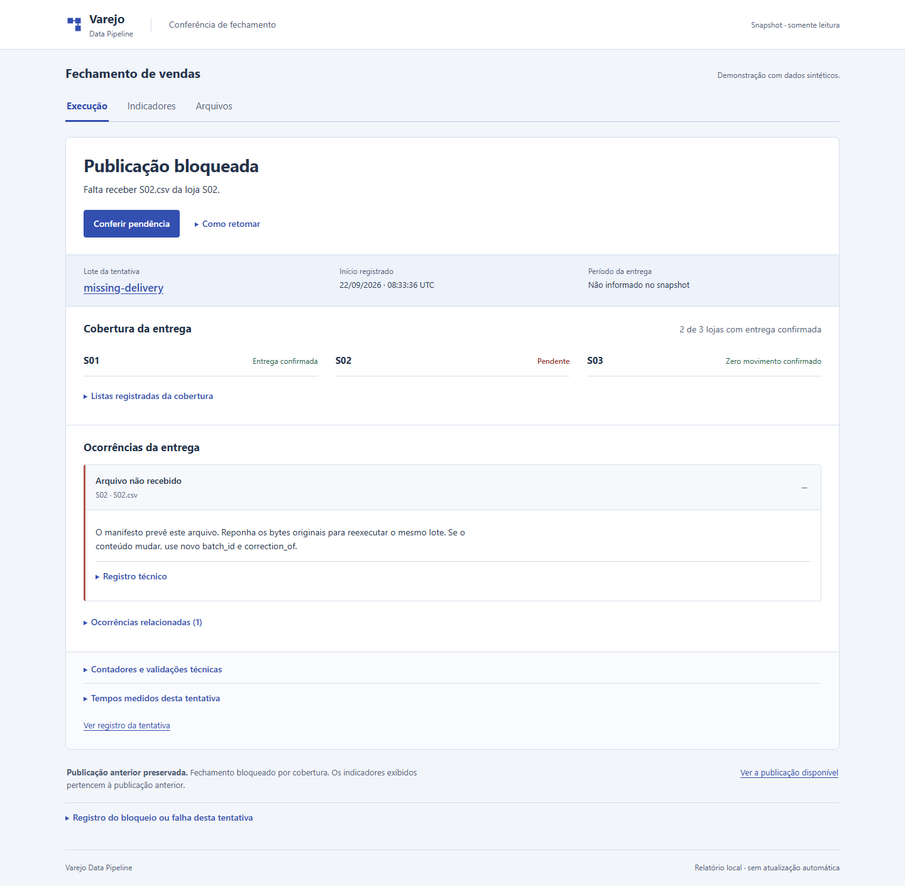

# Recuperar o fechamento junto com seu histórico

Um HTML de fechamento ou a última tabela gold não bastam para recuperar o pipeline. A publicação aponta para versões específicas de várias tabelas, e o histórico aceito determina quais correções podem entrar. Perder essas referências pode deixar totais aparentemente válidos sem o estado que permite conferi-los e continuar o processamento.

**A restauração local e as seis amostras de recomputação passaram em 22/09/2026.** Três publicações foram recuperadas em volume novo, com IDs, versões, linhas e totais iguais à origem. A medição tem execução e limites próprios. [Índice de evidências](evidence/state-proof/index.json).

## O conjunto que precisa sobreviver

A prova copia a árvore de estado e entradas de seu ambiente sintético sem escritores ativos. O inventário registra caminhos, tamanhos e SHA-256; o arquivo tar é local, sem compressão. O restore confere a cópia antes de criar o estado, recusa destino ocupado e mantém o mesmo caminho interno: os manifestos existentes contêm caminhos absolutos.

O [contrato de retenção](../scripts/proof_contracts.py) percorre a publicação vigente e os manifestos imutáveis. Identifica as tabelas, versões Delta e fontes Bronze dos lotes aceitos. Protege diretórios Delta completos, incluindo logs e arquivos de versões anteriores; uma proposta que alcance uma dessas referências é recusada. **Isso não executa limpeza nem autoriza VACUUM.** Selecionar arquivos individuais descartáveis exigiria outro contrato e outra prova de recuperação.

Copiar apenas arquivos que parecem recentes seria menor, mas poderia apagar versões ainda utilizadas por uma publicação anterior. A abordagem conservadora custa espaço e não resolve retenção acumulada. O limite de cópia desta ferramenta é 2 GiB, além do limite de entradas; não é uma quota do disco de produção.

## Cenário funcional e recusa

O roteiro desta prova é pequeno: publicação de **R$ 64**, entrega ausente que preserva **R$ 64**, reposição que mantém **R$ 64** e correção que publica **R$ 77**. É diferente da sequência histórica de oito estados descrita no [demo](demo.md). Os valores são literais da fixture, não metas ajustadas depois da medição.

O aceite exige ler a publicação vigente e as anteriores no destino por `load_snapshot`/`read_table`, comparando IDs, versões, linhas e totais com a origem. A cópia deve preservar os bytes da origem; controles negativos precisam recusar tar adulterado antes de criar o estado e destino ocupado sem alterar os arquivos já restaurados. Os relatórios reais de publicação, bloqueio, reposição e correção guardam seus próprios IDs.

O projeto já protegia a publicação contra falha de processo. Esta prova acrescenta recuperação a partir de uma cópia. **Não é recuperação em outro computador**, proteção contra perda do disco, backup agendado ou um objetivo de RPO/RTO cumprido.

## O que foi observado

O ensaio `pf-varejo-proof-e714096be80a` copiou 187 arquivos em um tar de 655.360 bytes. Origem antes, destino e origem depois mantiveram três publicações: versões 0, 1 e 2 das tabelas compartilhadas, com receita de 6.400, 6.400 e 7.700 centavos. Cada publicação tem duas linhas em gold por loja; os leitores oficiais conferiram também as outras tabelas. O histórico de revisões passou de quatro para cinco linhas na correção, enquanto o estado corrente manteve quatro itens. [Comparações completas](evidence/state-proof/restore.json).

O tar adulterado foi recusado antes de criar a raiz de estado. A tentativa de instalar sobre o destino ocupado foi recusada e seu inventário permaneceu igual. Três volumes próprios foram preservados para inspeção; os containers do ensaio foram removidos. A limpeza não é uma política de retenção dos dados.

| Etapa observada | Duração |
|---|---:|
| Preparar os quatro estados na origem | 120,265 s |
| Produzir o tar | 1,359 s |
| Conferir e instalar a cópia | 1,313 s |
| Ler as publicações no destino | 61,203 s |
| Reler as publicações na origem | 61,313 s |
| Cenário completo, com controles e limpeza | 251,851 s |

Esses intervalos são do ambiente e da fixture descritos. A instalação sozinha não mede recuperação integral. Os snapshots Docker não mostraram containers externos nessa execução; outras cargas do computador não foram controladas.

### Capturas do ensaio



A tela identifica a ausência de `S02.csv`, distingue S03 com zero movimento confirmado e mantém a publicação anterior. As capturas vêm dos HTMLs gerados pelo ensaio, não de payloads inventados para esta documentação: [publicação](images/state-proof/publication-1440.png), [reposição](images/state-proof/recovery-1440.png), [correção](images/state-proof/corrected-1440.png) e [bloqueio no celular](images/state-proof/blocked-390.png). Os quatro [relatórios HTML](evidence/state-proof/reports/blocked.html) permitem alternar Execução, Indicadores e Arquivos.

Foram conferidos seis PNGs, IDs, ausência de erro JavaScript, requisições externas e overflow global em 1440 e 390 px. [Versões, hashes e coletor](evidence/state-proof/captures.json). É leitura local de registros, sem nova execução Spark, estudo com usuários ou certificação de acessibilidade.

### Dificuldade encontrada e identidade da prova

A regressão inicialmente esgotou o limite de 512 processos/threads: a tentativa com a imagem atual atingiu exatamente 512 e registrou 11 eventos do limite, sem OOM. O teto foi ajustado para 1.024 antes do restore e da medição, mantendo 3 GiB, 2 CPUs e os prazos. A seleção de seis arquivos passou em **183 testes**, com pico de 531 processos/threads e nenhum evento de limite. Isso não é a suíte completa. As duas tentativas anteriores permanecem em [regressões](evidence/state-proof/regressions.json).

A primeira tentativa usou uma imagem histórica; o scan posterior não é atribuído a ela. Restore e medição usam `sha256:3cc3b95c1985397f1a3601a1c66531180ba0b8ef8738e5901dd400e805c719f3`, com as fontes identificadas em cada prova montadas somente para leitura. Spark 4.2.0, Delta 4.4.0 e 48 JARs do lock foram conferidos. O restore registrou 282 fontes. Na publicação inicial `939f2b7`, apenas `.gitattributes` havia mudado para preservar LF nas evidências públicas; 281 fontes continuavam idênticas naquele ponto.

Depois, `642c291` revisou a interface e `44cd017` corrigiu a leitura de publicação vazia; `93d80c0` acrescentou a origem dos assets. Em relação às 282 fontes das operações, essa versão mantém 271 blobs Git iguais e altera 11; acrescenta seis arquivos de apresentação. Os 20 arquivos das provas históricas, incluindo seis PNGs, permanecem intactos. A [associação das versões](evidence/state-proof-followup/association.json) identifica as diferenças. Restore, medição e suas capturas descrevem a fonte executada naquela ocasião; não são novas execuções da interface atual. A revisão de apresentação e seus limites estão em [qualidade da interface](frontend-quality.md).

## Medir antes de escolher processamento incremental

Recompor silver/gold facilita lidar com revisão, mudança de dia, cancelamento e retomada, mas relê o histórico. A medição foi definida com dois históricos sintéticos, **3.600 e 10.800 linhas**, e um lote novo de **360 linhas** com chaves disjuntas. Cada tamanho tem três repetições em volumes novos derivados da mesma baseline daquele tamanho. Seed 42, limite de 3 GiB, 2 CPUs e 1.024 processos/threads, prazo de 600 s por amostra e 1.800 s para a medição completa são registrados antes de executar.

Um oráculo separado em CSV/Decimal calcula os indicadores esperados, sem chamar as transformações Spark. O tempo de `create_spark` fica separado; inicialização tardia permanece no processamento, sem desconto estimado. Geração, processamento, conferência e relatório têm intervalos próprios. `memory.peak` mede o container inteiro, incluindo JVM e cache de páginas; disco representa bytes lógicos da árvore de prova, sem temporários Spark, tar e imagem.

Caches do host não são apagados. Os seis resultados planejados permanecem no relatório, inclusive timeout, falha ou amostra não iniciada. Três repetições não sustentam um p95 geral; a mediana, quando apresentada, descreve somente as concluídas e vem acompanhada das censuras. Não se transforma falha funcional em resultado inconclusivo de desempenho.

Essa comparação informa o custo local observado. Não demonstra superioridade sobre Python/SQL nem escala comercial. Uma versão incremental só se justifica com necessidade medida e equivalência nos casos de data, cancelamento, reativação e falha antes da publicação.

### Resultado da medição

O ensaio `pf-varejo-proof-ae96381a19bf` concluiu as seis amostras planejadas, sem falha ou censura. Todas coincidiram com o oráculo independente: 3.960 ou 11.160 registros totais, com receita de 15.264.694 ou 42.179.144 centavos, respectivamente. As três cópias de cada tamanho partiram da mesma baseline. [Observações e protocolo](evidence/state-proof/measurement.json).

| Histórico + lote novo | Repetição 1 | Repetição 2 | Repetição 3 | Mediana do processamento |
|---|---:|---:|---:|---:|
| 3.600 + 360 linhas | 36,712 s | 37,349 s | 37,045 s | 37,045 s |
| 10.800 + 360 linhas | 37,773 s | 38,612 s | 38,180 s | 38,180 s |

A chamada `create_spark` levou 34,466–34,569 s, separadamente do processamento. As amostras completas observadas pelo host levaram 76,360–78,750 s; a janela inteira, com baselines, cópias e limpeza, durou 609,421 s. A memória máxima dos containers variou de 964.927.488 a 1.176.412.160 bytes. O estado passou de 5.577.949 para cerca de 6,98 milhões de bytes no tamanho menor e de 16.254.970 para cerca de 19,26 milhões no maior. Não são heap da JVM nem uso físico total de disco.

`generation_seconds` inclui configuração das referências, geração dos dois lotes CSV (12 arquivos por lote) e construção/gravação do oráculo. As verificações e a geração do HTML têm tempos próprios no JSON. As 282 fontes ficaram estáveis; containers próprios removidos e oito volumes preservados.

**Limite da comparação:** o snapshot inicial não tinha container externo ativo; o final mostrou `ui-api-art-review`, de outra tarefa, sem limites de CPU/memória configurados. Ele foi preservado, e não sabemos em quais amostras competiu por recursos. Caches também não foram controlados. A diferença entre medianas é descritiva; não prova efeito causal do tamanho nem permite projetar capacidade comercial.

O dado útil para a decisão atual é que startup e processamento têm custos visíveis mesmo nesse volume pequeno. A prova sustenta manter uma implementação conferível e medir uma alternativa antes de acrescentar estado incremental. Não estabelece que Spark seja a opção mais barata ou mais rápida.

## Reproduzir sem reconstruir dependências desnecessariamente

Use uma imagem local previamente construída e seu ID SHA-256 completo. O [executor](../scripts/prove_state.py) cria volumes próprios, monta o código somente para leitura e executa sem rede. O diretório de saída deve ser novo, fora do repositório e do OneDrive; não coloque cópias privadas em Git.

```powershell
python scripts/prove_state.py restore --image sha256:ID-COMPLETO --output D:/private-evidence/pipeline-restore-new --execute
python scripts/prove_state.py measure --image sha256:ID-COMPLETO --output D:/private-evidence/pipeline-measure-new --execute
```

São comandos de reprodução com placeholders, não resultados executados. O runner registra fontes, identidade de imagem, limites e recursos. A limpeza remove somente seus containers; **volumes ficam preservados para inspeção**. Não há prune global nem interrupção de serviços externos.

## Por que manter essa arquitetura

Uma alternativa menor, como Python com SQLite, merece comparação para esse volume. Spark/Delta exercita histórico versionado e publicação entre tabelas; o tamanho sintético sozinho não exige um cluster. O manifesto é necessário porque transações Delta individuais não tornam várias tabelas uma única transação. Essas garantias dependem do filesystem Linux local e do escritor exclusivo; não se transferem automaticamente para armazenamento remoto.

O runtime também tem um custo de manutenção concreto: três builds JVM próprios, receitas, ferramentas e regressões. A [política de substituição](runtime-upgrade.md) exige procedência, compatibilidade, testes e scan de um artefato oficial candidato antes de removê-los. O aviso MEDIUM conhecido do backport continua visível; não há alegação de zero vulnerabilidades.
